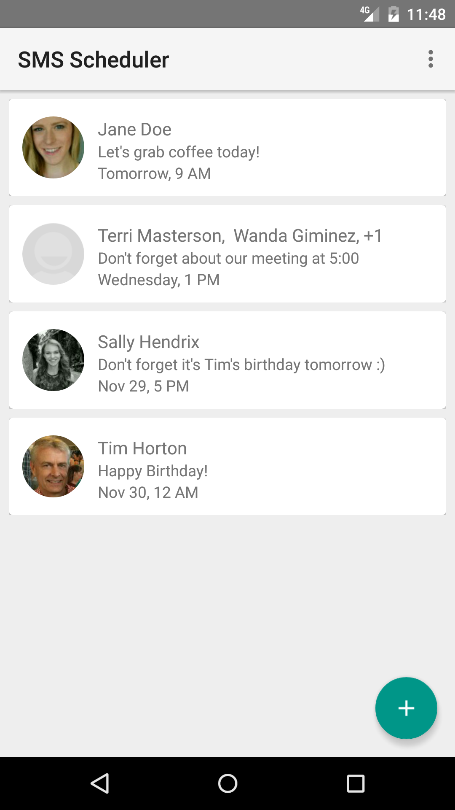
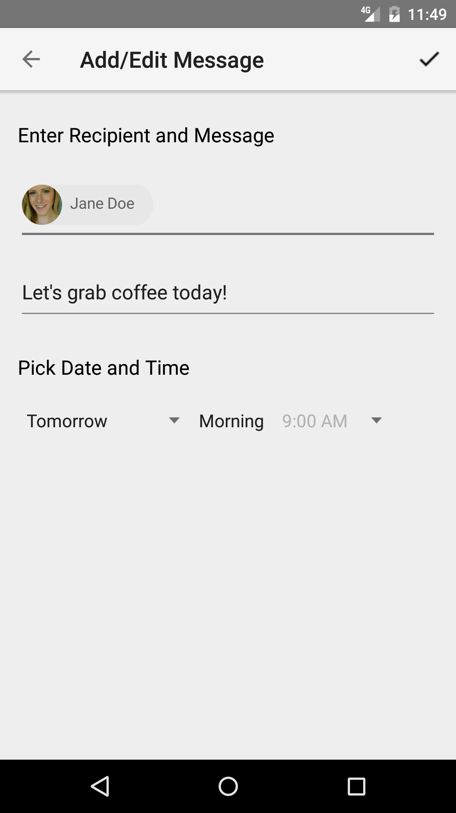

# Material SMS Scheduler
Originally a class project by myself, Kyle Szombathy and classmate Jonah Johnson, I have since taken over this project and have developed it from an idea into a full-fledged app. 
This project has solidified my expertise of Java, helped me learn the Android ecosystem as well as features like SQLite, implementing and modifying 3rd party libraries, and much, much more.
https://play.google.com/store/apps/details?id=com.kyleszombathy.sms_scheduler&hl=en

## Screenshots

    
    
    

## Project documents
[This document](https://drive.google.com/file/d/0B4ela-k3pZerYzd0emFLb1VJOVk/view?usp=sharing) was the culmination of our efforts in CSC 131 at Sac State. Since the document has been written, many more features have been develope and smoothed out.
